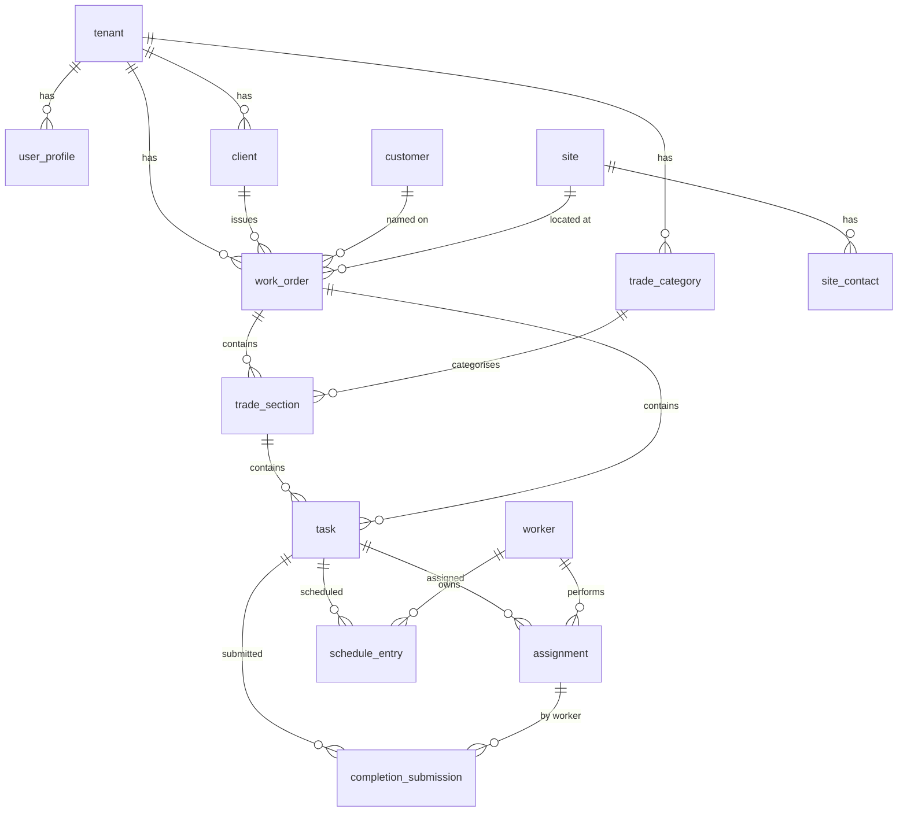
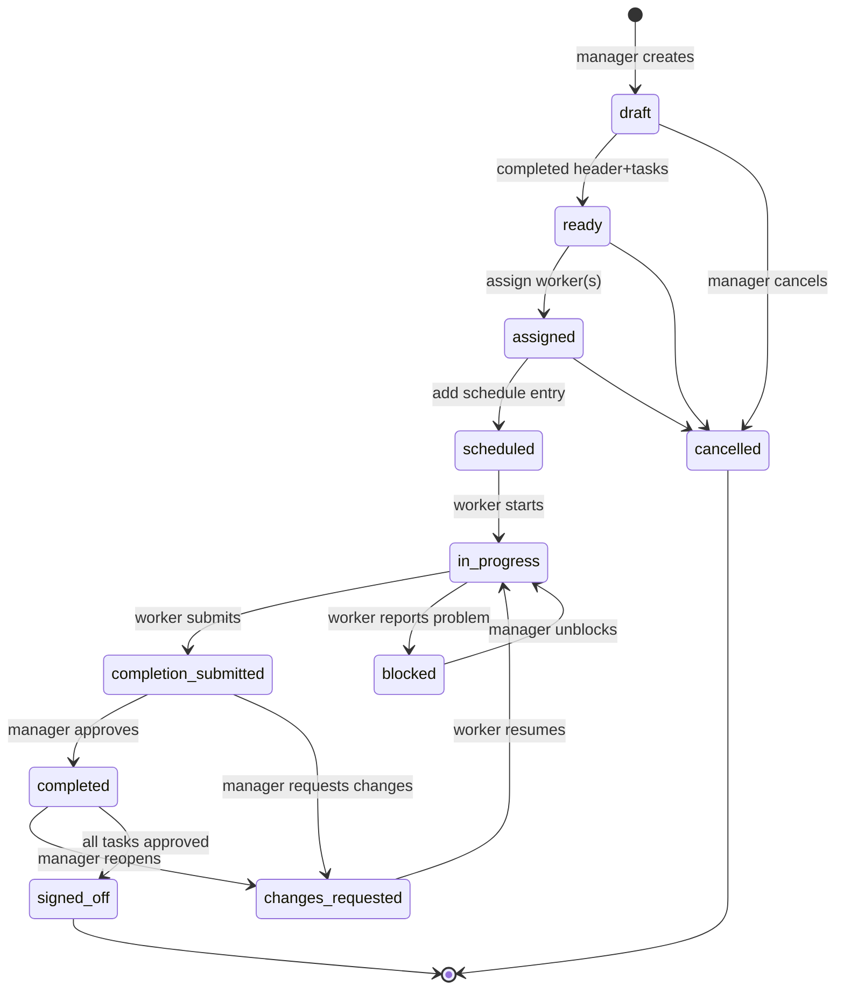

# Work-Order Management Web Application - Technical and Product Plan

Prepared for a solo-developed MVP for a construction maintenance and trades subcontracting company (Australia). Grounded in inspection of the supplied example work order (`work_order_20299-29572_REME_PAINTING_GROUP_PTY_LTD.pdf`, issued by Bentino Pty Ltd to REME PAINTING GROUP PTY LTD).

Australian English is used throughout. No em dashes; a standard hyphen, comma or parenthesis is used instead.

---

## 1. Understanding and assumptions

### 1.1 Restatement of the problem

A trades subcontracting company receives work orders from principals (builders, insurers, restorers) as PDF email attachments. Today these are managed manually: a director reads the PDF, rings workers, jots tasks and dates on paper or in spreadsheets, and chases completion by phone. The work is multi-trade (one work order spans Carpentry, Painting, Plastering, Insulation, Cleaning, Preliminaries, Waste Removal and more), tasks are split among different workers, and work is spread across multiple days and sites.

The application gives the company one system for: capturing work orders, breaking them into trade-grouped tasks, assigning tasks to individual workers (sometimes several per task, sometimes one worker for the whole order), scheduling, mobile field execution with notes and photos, manager approval, and a defensible audit trail.

The binding, non-negotiable constraint is **pricing separation**: workers must never see unit rates, line prices, subtotals, GST or totals. Enforced at the database, API and backend layers, never only in the UI.

### 1.2 What the supplied example revealed (and why it matters)

Inspecting the real PDF changed several decisions versus the generic brief:

| Observation in the real PDF | Design consequence |
|---|---|
| Issuer (principal/client) is Bentino Pty Ltd, with ABN, licence numbers and office addresses in the header/footer | Model a Client (principal) organisation separately from the Customer (the household/site occupant). Store issuer ABN/licences on the Client record. |
| "Work Order Assigned: REME PAINTING GROUP PTY LTD" - the subcontractor is your friend's company | This is the tenant. The whole app is scoped to one tenant for the MVP; the principal (Bentino) is a Client record. |
| Separate "Supervisor" (Astafanos Kheir) and "Contact" fields, plus a Customer (Francesco Amato) and Customer Phone | Distinguish: `client_supervisor` (principal's rep), `site_contact` (on-site access contact), and `customer` (occupant/bill-to). These are three separate concepts, not one. |
| Work Order Number `20299-29572` is composite (Job 20299, sequence 29572); Job Number `20299`; Client Reference `12201037101` | Store all three as distinct indexed fields. Client Reference is the principal's reference and is the best duplicate-detection key. |
| Trade headers (Carpentry, Cleaning, Insulation, Painting, Plastering, Preliminaries, Waste Removal, Miscellaneous), each tagged "Material" | Trade Category is a first-class entity. The word "Material" after each trade is a column header, not pricing (see below). |
| Location sub-headers inside a trade ("General Works", "Lounge" = room/area) | Task line items can carry an optional Area/Location grouping below the trade. Support area grouping without forcing it. |
| Tasks rendered as `description   quantity/unit` (e.g. `6/m2`, `3/lm`, `3/ea`) | Quantity + unit are extractable as a paired token `NN/<unit>`. Unit vocabulary is small (ea, m2, lm, m3, hr). |
| Notes are free paragraphs under "Additional Notes/Instructions" and a "General:" disclaimer block | Treat notes/comments as free text with a flagged type (site instructions vs general disclaimer). |
| **No per-line dollar rates appear.** Only aggregate totals: Subtotal $2,000.00, GST $200.00 (exactly 10%), Total $2,200.00 | The data model must allow `unit_rate` to be nullable per task and store a work-order-level `subtotal`, `gst`, `total` that may be entered manually even when no line rates exist. This is the single biggest divergence from the brief. |
| ~60 trailing pages are GICOP / Anti-Slavery legal boilerplate appended after the Totals block | Extraction must stop at the Totals block and ignore appended legal pages. Page count alone is a useless integrity signal. |

**Key call-out on the `Material` token.** The word "Material" appears immediately after each trade header (e.g. `Carpentry ... Material`). It is a column-header artifact of the PDF layout, sitting roughly above the quantity column. It is NOT a price or a material cost line. Any extractor must be told to ignore it, otherwise it risks being parsed as a stray line item. This is exactly the kind of layout quirk that makes fully automatic parsing unreliable.

### 1.3 The business problem

There is no single source of truth. The cost of the status quo is double-handling, missed tasks, no proof of completion, no audit trail for insurers, and pricing data sitting in PDFs and personal phones. The win is one captured work order, mobile execution, sign-off and history.

### 1.4 Manager's needs

Capture work orders (manually first, semi-automated later), split into trade-grouped tasks, assign per task or per order, schedule, see status at a glance on a dashboard and calendar, review completion photos, approve or return work, keep an audit history, and keep all pricing visible only to managers.

### 1.5 Worker's needs

Open the app on a phone with poor signal; see only what is assigned to them; read what to do, where, and how to get in; start, complete, photograph and note the task; report a problem; and know whether submitted work was approved or returned. No pricing, ever.

### 1.6 The pricing-separation requirement

Pricing data is toxic to worker contexts. It must not appear in worker API responses, DB rows returned to workers, views, notifications, exports, offline caches, logs or error messages. This is enforced with a separate pricing table, RLS policies that deny workers, worker API endpoints that never join pricing, signed photo URLs, and redaction in logs. Section 3, 4 and 11 specify exactly how.

### 1.7 Expected operating scale

One tenant, 1 to a few managers, 5 to 30 workers, 50 to 300 active work orders per month. Each work order carries roughly 8 to 30 line tasks. Completion photos are the dominant storage cost: assume 5 to 20 photos per task, 1 to 4 MB each (after client-side downscaling). This fits comfortably in the lowest paid tiers of Supabase or Cloudflare plus an object store.

### 1.8 Additional assumptions made

- The principals are builders, insurers and restorers; one work order can come from each, with different layouts. The MVP supports manual entry for any layout.
- A "Client" is the principal (builder/insurer) that issues the work order; a "Customer" is the end household/occupant named on the work order. They are separate entities.
- GST is stored as an explicit rate (default 0.10) on each work order, not hard-coded.
- All money is AUD, stored as integer cents to avoid float rounding.
- Default timezone is `Australia/Sydney`; all timestamps stored as UTC, rendered local for the user's tz.
- Mobile reception is poor on-site; offline-first reads for the worker's assigned work, optimistic writes for completion, resume-on-reconnect uploads.
- The company already has an email address; the MVP does not require a new inbound mailbox.
- The first manager is bootstrapped via a CLI/admin seed script; no public sign-up.
- Workers have personal phones (iOS/Android); they will install a PWA but may not enable push notifications.
- Photos, sign-off and audit are retained for at least seven years (insurance/contractor record), but original PDFs may be purged after extraction is confirmed and the work order is signed off, subject to owner confirmation (Section 14).
- One tenant only for MVP, but every table carries `tenant_id` and RLS is tenant-scoped so multi-company is an additive change, not a rewrite.

### 1.9 Genuinely ambiguous (assume and proceed)

- Whether each trade task must carry a per-line dollar rate. The example shows no line rates (only totals). **Assumption:** per-line `unit_rate` is optional; the work order stores `subtotal/gst/total` that the manager can type in regardless. Line rates, if used, are for the manager's own costing, not exposed to workers.
- Whether a "lead worker" is a formal role or just the first assignee. **Assumption:** treat lead as an explicit flag on an assignment record (`is_lead`), settable by the manager; do not overload assignment order.
- Whether the company bills clients through this app. **Assumption:** no invoicing in MVP; pricing capture is for costing/visibility only.
- Whether workers should see each other. **Assumption:** workers see only their own assignments; they do not see other workers' names on a shared task beyond a count (privacy), unless the manager opts in per task.

### 1.10 Terminology to standardise before development

| Term | Definition (canonical) |
|---|---|
| Tenant | The subcontracting company (e.g. REME PAINTING GROUP). The whole app's data scope. |
| Client (Principal) | The issuer of the work order: builder, insurer or restorer (e.g. Bentino Pty Ltd). Has ABN, contacts, address. |
| Customer | The end household/occupant billed/referenced (e.g. Francesco Amato). |
| Site | A physical job address. May differ from Customer's home address. |
| Site Contact | The person to call to access the site (may equal Customer or be a separate site supervisor). |
| Work Order | The principal's document covering a job. Carries work-order number, job number, client reference, totals. |
| Trade Category | A grouping of tasks (Carpentry, Painting, etc.). |
| Area / Location | An optional sub-grouping of tasks within a trade (e.g. Lounge, General Works). |
| Task | A single line item within a trade: description, quantity, unit, optional rate. The unit of assignment and completion. |
| Assignment | The link between a Task and one Worker (or several workers via participants). |
| Schedule Entry | A dated/planned occurrence of a task or work order. A task can have several (multi-day). |
| Completion Submission | A worker's submission: notes, photos, status, for a task or task participant. |
| Pricing | Rates, line amounts, subtotals, GST, totals. Never exposed to workers. |
| Signed Off | The terminal approved state of a work order (all tasks approved). |

---

## 2. Recommended architecture and technology stack

The headline decision is whether to build this on **Supabase + Next.js** or **Cloudflare Workers + D1**. Both are in the builder's comfort set. The recommendation is Supabase + Next.js for the MVP, with Cloudflare R2 for object storage and Cron/Queues for background jobs that touch the network. Rationale is below.

### 2.1 Frontend framework

**Recommendation: Next.js (App Router) on React + TypeScript, hosted on Vercel or self-hosted.**

Why it suits this app: workers use a mobile PWA and managers use desktop; one codebase serves both with route-level role gating. Server Components and Server Actions give cheap server-side authorisation boundaries, which is the crux of pricing separation (the server decides what fields reach the client). Vercel's edge network helps poor-signal mobile reads. TypeScript catches the kind of field-leakage bugs (a pricing field sneaking into a worker DTO) that would be catastrophic here.

Secondary alternative: a Vite + React SPA with a Cloudflare Workers backend. Preferable if the builder wants minimum platform coupling and is comfortable running their own API layer and RLS-equivalent checks manually. It trades Vercel convenience for more glue code. For a solo dev who values speed and whose core risk is data leakage (not vendor lock-in), Next.js + Supabase Server Actions is the better fit.

### 2.2 UI and component system

**Recommendation: shadcn/ui (Radix + Tailwind) for components; react-hook-form + zod for forms; tanstack/table for the manager data grids; fullcalendar or a lightweight week/day grid for the calendar.**

Why: shadcn gives owned, copy-in components (no opaque dependency) that are easy to restyle for a trade-field UI with big touch targets. react-hook-form + zod makes the large trade-grouped task form performant and validates server and client with shared schemas. The manager task grid is where lots of line items are entered, so a real virtualised table matters.

Secondary alternative: Mantine or MUI for an out-of-the-box component kit. Preferable if you want to skip styling work entirely and accept a heavier, less owned dependency. shadcn wins for long-term maintainability and control, which matters for a multi-year app.

### 2.3 Backend and API approach

**Recommendation: Supabase Postgres as the system of record, accessed through Next.js Server Actions (or Route Handlers) for all mutations and most reads, with Postgres RLS as the hard security backstop.**

Why: Supabase bundles Postgres, Auth, Storage and (optionally) Edge Functions, which removes a pile of integration glue for a solo dev. The sharp edge in this domain is pricing: the architecture below uses RLS to deny workers any row from pricing tables, and Server Actions that build **explicit worker DTOs** (typed objects containing only non-pricing fields). The DB is the last line of defence: even if a Server Action has a bug, RLS still blocks the worker session from pricing rows.

Secondary alternative: Cloudflare Workers + D1 + Durable Objects. Preferable if you want a single edge platform with no Vercel dependency and are comfortable writing every authorisation check in code (D1 has no RLS). The absence of RLS is the deciding factor against it for THIS app, where the pricing-leak risk is the core threat and RLS is uniquely valuable. D1 is also SQLite-based, lacking the richer constraint/trigger tooling Postgres offers for audit and totals.

### 2.4 Database

**Recommendation: Supabase Postgres (managed Postgres 16), with Row Level Security on every table.**

Key patterns:
- Every tenant-scoped table has `tenant_id`.
- `auth.uid()` mapped to a `user_profile` gives the current user's role and `worker_id`/`tenant_id`.
- Two pricing-side tables (`task_pricing`, `work_order_totals`) carry RLS policies that grant SELECT only to managers.
- Monetary values stored as `bigint` cents.
- Audit history via append-only tables populated by triggers.
- Generated columns / `numeric(12,2)` check constraints enforce non-negative totals.

Secondary alternative: Cloudflare D1 (SQLite). Preferable only if you commit fully to the Cloudflare stack and accept hand-rolled row security. Not recommended here due to RLS value and richer Postgres types.

### 2.5 Authentication

**Recommendation: Supabase Auth (email + password), with an invitation-link flow for workers and an optional TOTP MFA for managers.**

Why: managed, audited, with RBAC-friendly JWT carrying the user's role and tenant. Invitation links (magic-link style) avoid sending temporary passwords. MFA for managers is a one-line enablement and protects the role that can see pricing and approve work.

Secondary alternative: Clerk. Preferable if you want richer managed UX (organisation switches, social logins) and less custom. Supabase Auth wins for cost and because it shares the same identity row the RLS policies key off, simplifying the security model.

### 2.6 Role-based access control

**Recommendation: a single `role` enum on `user_profile` (`manager` | `worker`) plus RLS, plus a thin server-side `requireRole()` guard on every Server Action. No client-trusted role checks.**

Why: enough granularity for the MVP, trivially extended to more manager sub-roles later by widening the enum and adding finer policies. The hard requirement is that worker is denied pricing at the row level; that is an RLS policy, not a UI toggle.

Secondary alternative: a full permission matrix table (caspbin-style). Preferable once you have more than two roles with overlapping-but-different permissions. Overkill for the MVP.

### 2.7 File and photo storage

**Recommendation: Cloudflare R2 for completion photos and original PDFs; signed URLs issued by the backend with short TTLs and role checks. Avoid Supabase Storage buckets for the original PDFs because they contain pricing.**

Why: R2 is cheap (no egress fees), durable, and lets the backend mint time-limited signed URLs only after checking the caller is a manager (for PDFs) or an assignee (for their own photos). Original PDFs contain pricing and must never be reachable by a worker, so their bucket policy denies anonymous access entirely and the app never exposes a worker-readable URL to them.

Secondary alternative: Supabase Storage. Preferable for fewer moving parts if you don't want a second platform. R2 wins on egress cost for photo-heavy work and on cleanly isolating the pricing PDFs.

### 2.8 PDF processing

**Recommendation for MVP: manual entry is the only MVP intake; the extractor is a Version 2 feature.** When built (Section 9): `pdftotext`/`pdfplumber` for text PDFs; `tesseract` or a hosted OCR fallback for scans; a structured-extraction LLM call (GPT-4o-mini or Claude Haiku) only on the already-extracted text, never sending raw pricing PDFs through any pipeline that can log them; extraction writes to a `pdf_import` + `extraction_result` draft that a manager must confirm.

Why MVP defers this: the real PDF shows that even a single layout has fragile artifacts (the stray "Material" token, composite numbers, trailing legal pages). A reliable extractor needs several real samples per client layout. Manual entry of 8 to 30 line items is fast with a good form, and removes the risk of AI extraction errors becoming live pricing data. The upgrade path is staged.

Secondary alternative: start with email-in + LLM extraction immediately. Preferable only if the client flow makes manual entry impractical (e.g. they get 50 PDFs/day). At 50 to 300 per month manual entry is viable and far safer.

### 2.9 Email delivery

**Recommendation: Resend for transactional email (invitations, reset, manager review notifications).**

Why: simple API, good deliverability, cheap at this volume.

Secondary alternative: Amazon SES. Preferable at high volume for cost. Overkill at MVP volume, and Resend is friendlier for a solo dev.

### 2.10 SMS / notification delivery

**Recommendation: SMS via a low-volume provider (Melrose or Clicksend for AU, or Twilio) for the single highest-value nudge ("New work assigned to you; open the app"), plus in-app + email. Browser/native push is deferred to V2.**

Why: tradespeople on site often don't have push enabled and ignore email, but they read SMS. A single SMS per assignment (throttled, opt-out) is the lightest reliable channel. Push is deferred because it adds install/permission friction and the MVP can function with SMS + a PWA that they open deliberately.

Secondary alternative: web push notifications. Preferable once PWA install is sticky and you want free, repeatable nudges. Add in V2.

### 2.11 Background jobs and queues

**Recommendation: Supabase Edge Functions or a small Cloudflare Queue + Worker for: notification dispatch, photo post-processing (thumbnails, EXIF strip), and the future PDF extraction. Schedule with `pg_cron` (Supabase) or a Cron Trigger.**

Why: keeps heavy/async work off request paths, handles resumable photo uploads and retries.

Secondary alternative: Inngest or Trigger.dev for a fuller job framework. Preferable if job complexity grows (multi-step extraction pipelines). `pg_cron` + queues is enough for MVP.

### 2.12 Hosting

**Recommendation: Vercel (frontend + Server Actions/API), Supabase (DB/Auth/Edge), Cloudflare R2 (objects).**

Why: lowest glue for a solo dev, generous free/starter tiers cover MVP.

Secondary alternative: self-host Next.js on Fly.io + Supabase. Preferable if you want to avoid Vercel pricing cliffs at traffic extremes. The volumes here make Vercel fine.

### 2.13 Logging and monitoring

**Recommendation: structured logs with redaction middleware that strips known pricing keys (`rate`, `amount`, `subtotal`, `gst`, `total`) before any log write; Sentry for errors; Vercel/Supabase dashboards for traffic.**

Why: preventing pricing leaking into logs is an explicit requirement. A redacting serializer on the logger is the control.

Secondary alternative: Logflare/OpenObserve self-hosted. Preferable if you want full log control. Sentry + redacted console logs is enough for MVP.

### 2.14 Error reporting

**Recommendation: Sentry (frontend + server), with PII/pricing scrubbing in the beforeSend hook.**

Why: fast to add; the scrubbing hook is where you drop pricing keys from breadcrumbs.

Secondary alternative: self-hosted Glitchtip. Preferable to avoid sending any data off-platform (paranoia about pricing). Reasonable; Sentry with scrubbing is acceptable.

### 2.15 Automated backups

**Recommendation: Supabase daily backups (PITR on a paid plan) plus a weekly logical `pg_dump` to R2 as a second copy. Test a restore quarterly.**

Why: R2 copy is independent of the Supabase platform; PITR gives point-in-time recovery for accidental deletes.

Secondary alternative: AWS RDS automated backups. Preferable only if you moved off Supabase. N/A here.

### 2.16 Local development

**Recommendation: local Supabase via `supabase` CLI (Docker), R2 via `minio` or the `wrangler` local R2, `pnpm dev` for Next.js, seed script that creates a tenant, a manager, three workers, and a sample work order mirroring the Bentino/REME example.**

Why: a seed that mirrors the real example is the fastest way to validate the data model and the pricing-separation tests.

Secondary alternative: a hosted dev project only. Preferable for fidelity, worse for iteration speed and cost.

### 2.17 Testing

**Recommendation: Vitest (unit + integration incl. RLS policy tests against a throwaway local DB), Playwright (end-to-end incl. the pricing-leak fixtures), and a dedicated `pricing-leak.test.ts` that signs in as a worker and asserts no pricing keys appear in any API response or rendered page. See Section 11.**

Secondary alternative: Jest. Preferable only if the team knows it. Vitest is the modern default with Vite/Next.

### 2.18 Deployment workflow

**Recommendation: GitHub trunk-based; preview deploys per PR on Vercel; Supabase migrations via `supabase db push` on merge to main with a manual prod cut; R2 buckets via Terraform or wrangler. Automated tests gate merge (CI runs Vitest + Playwright + RLS tests).**

Secondary alternative: manual deploys. Preferable only at the very start. CI gating is essential before real data lands.

### 2.19 Rough monthly operating-cost estimate

Predictable platform costs (fixed, MVP):

| Item | Provider | Approx AUD/month |
|---|---|---|
| Frontend hosting + Server Actions | Vercel Pro | ~30 |
| DB + Auth + Edge (with PITR) | Supabase Pro | ~40 |
| Object storage (R2, 50 GB) | Cloudflare | ~3 |
| DNS / CDN / WAF | Cloudflare | ~0 to 8 |
| Error reporting | Sentry Team | ~30 |
| Domain | registrar | ~2 amortised |
| **Predictable subtotal** | | **~110 to 120** |

Usage-based costs (at 30 workers, 300 work orders/month, ~8 to 30 tasks each, ~10 photos/task):

| Item | Assumption | Approx AUD/month |
|---|---|---|
| Photo storage growth | ~300 orders x ~15 tasks avg is too high; realistic 300 x 12 tasks avg x 10 photos x 1.5 MB after downscale = 54 GB/month | R2 ~1.50/month growth |
| R2 request volume | negligible | <1 |
| SMS (assignment nudges) | ~300 work orders, mostly 1 SMS each = ~300, some 2 | Melrose/Clicksend ~0.05 to 0.10/SMS = ~15 to 30 |
| Transactional email (invites, resets, manager reviews) | ~1,000/month | Resend ~0 (within free) to ~15 |
| LLM/PDF extraction (V2) | ~300 PDFs/month, ~15k tokens each | GPT-4o-mini ~6 to 15 (Haiku similar) |
| Supabase bandwidth/egress | modest | within plan |

**Ballpark total: ~125 to 180 AUD/month at target load**, dominated by fixed tiers. The first client can run on free/starter tiers for ~0 to 40/month in early production. Pricing isolation and audit are not cost drivers.

---

## 3. Data model

Design principle: **operational data and financial data live in separate tables.** A worker never selects from `task_pricing` or `work_order_totals` because RLS denies them. Worker-facing queries select only operational columns. There is no view that joins pricing into operational rows.

All tenant-scoped tables carry `tenant_id uuid not null`. All monetary values are `bigint` cents (AUD). All timestamps are `timestamptz` (UTC). Surrogate keys are `bigint generated always as identity` unless a natural key is useful.

### 3.1 Core entities and field sketches

**`tenant`** - the subcontracting company.
- id (pk), name, abn, default_timezone (`Australia/Sydney`), default_gst_rate numeric(5,4) default 0.10, created_at.
- Security: only managers of this tenant read/update settings.

**`user_profile`** - bridges Supabase Auth user to app.
- id (= auth.users.id, pk), tenant_id (fk), role enum('manager','worker'), display_name, email, phone, is_active bool, worker_id (fk nullable, set when role=worker), mfa_enrolled bool, created_at, disabled_at (nullable), disabled_reason.
- Index: (tenant_id, role); unique(email).
- Security: a user reads only their own row; managers read tenant's users; workers cannot list users.

**`worker`** - worker-specific profile.
- id (pk), tenant_id (fk), user_id (fk unique), trade_specialties text[] (forSuggestions), default_daily_capacity int, vehicle_notes, created_at.
- Index: (tenant_id).
- Archive behaviour: never hard delete; disable via `user_profile.is_active=false`. Existing assignments remain for audit; can be filtered out of future assignments.

**`client`** (principal) - builder/insurer/restorer issuing work orders.
- id (pk), tenant_id (fk), name (e.g. "Bentino Pty Ltd"), abn, licence_numbers text, billing_address, account_manager_name, account_manager_email, account_manager_phone, default_trade_categories (for that client), created_at.
- Index: (tenant_id, name); unique(tenant_id, lower(name)).

**`customer`** - household/occupant named on a work order.
- id (pk), tenant_id (fk), name, phone, email, created_at.
- Index: (tenant_id, phone) for dedup.

**`site`** - job address.
- id (pk), tenant_id (fk), street_address, suburb, state, postcode, latitude, longitude, access_notes, created_at.
- Index: (tenant_id, lower(street_address), postcode).
- Geocode on save (lat/lng) so the maps link is accurate; lat/lng is the only stored derived field.

**`site_contact`** - who to call to access the site.
- id (pk), site_id (fk), name, phone, relationship (e.g. "customer","supervisor"," neighbour"), notes.
- Notes: matches the real PDF where Supervisor, Contact and Customer are three different things.

**`trade_category`** - Trade grouping.
- id (pk), tenant_id (fk), name, is_system bool (seeds: Carpentry, Cleaning, Insulation, Painting, Plastering, Preliminaries, Waste Removal, Miscellaneous), sort_order, created_at.
- Unique(tenant_id, lower(name)).
- Allows client-specific categories.

**`work_order`** - the document.
- id (pk), tenant_id (fk), client_id (fk), customer_id (fk nullable), site_id (fk), work_order_number text (e.g. "20299-29572", nullable), job_number text (e.g. "20299", nullable), client_reference text (e.g. "12201037101", nullable), client_supervisor_name, client_supervisor_phone, issued_at timestamptz, start_date date, completion_due_date date, status enum, notes text, additional_instructions text, created_by (fk user_profile), created_at, updated_at.
- Index: (tenant_id, status), (tenant_id, client_reference), (tenant_id, work_order_number), (tenant_id, start_date).
- Unique(tenant_id, coalesce(client_reference,'')) partial where client_reference is not null; also unique(tenant_id, work_order_number) where not null.
- Note: pricing (subtotal/gst/total) is NOT on this table. It lives in `work_order_totals`.

**`work_order_totals`** (financial) - the pricing for the whole order.
- work_order_id (pk, fk), subtotal_cents bigint, gst_rate numeric(5,4), gst_cents bigint, total_cents bigint, total_override bool (true if manager typed it manually vs summed), updated_by (fk user_profile), updated_at.
- Check: subtotal_cents >= 0, gst_cents >= 0, total_cents = subtotal_cents + gst_cents (unless override).
- **RLS: SELECT/UPDATE only for tenant managers. Workers denied.** This is the central pricing-isolation table.

**`trade_section`** - a trade block within a work order (matches the PDF's trade headers).
- id (pk), work_order_id (fk), trade_category_id (fk), area_label text nullable (e.g. "Lounge","General Works"), sort_order.
- Why: the real PDF nests tasks under a trade header and sometimes an area sub-header. This models both cleanly and lets assign-by-trade work.

**`task`** - a single line item (operational).
- id (pk), work_order_id (fk), trade_section_id (fk), description text, quantity numeric(12,3), unit enum('ea','m2','lm','m3','hr', plus extensible), area_label text (denormalised for quick filter), sort_order, status enum, created_at, updated_at.
- Index: (work_order_id), (trade_section_id), (status).
- No pricing columns on task. Pricing lives in `task_pricing`.

**`task_pricing`** (financial) - per-task rate, optional.
- task_id (pk, fk, on delete cascade), unit_rate_cents bigint nullable, line_total_cents bigint nullable (nullable because the example shows none), is_estimate bool, updated_by (fk user_profile), updated_at.
- **RLS: SELECT/UPDATE only for tenant managers. Workers denied.**
- Why optional/nullable: the real work order had no per-line rates, only aggregate totals. So a task may simply have no pricing row, and the work order's official price lives in `work_order_totals`.

**`assignment`** - link between a task and worker(s).
- id (pk), task_id (fk), worker_id (fk), is_lead bool default false, role text (e.g. "primary","assistant"), status enum('assigned','accepted','declined','reassigned','completed'), assigned_by (fk user_profile), assigned_at, accepted_at.
- Index: (worker_id, status), (task_id).
- Unique(task_id, worker_id) (no double-assign same worker).
- Whole-order assignment: a Server Action creates one assignment per task for the chosen worker, with is_lead=true on each (or a single lead flag stored on the work order; see 3.3). Multi-worker task: multiple rows with one is_lead=true.
- A lead worker for the whole order: store `lead_worker_id` on `work_order` (nullable) as a denormalised convenience, kept consistent with assignments transactionally.

**`schedule_entry`** - when work happens.
- id (pk), task_id (fk nullable) or work_order_id (fk nullable) (one of), worker_id (fk nullable, for worker calendar), planned_date date, start_time time nullable, estimated_hours numeric nullable, is_multi_day_seq int (groups a span), created_by, created_at.
- Index: (worker_id, planned_date), (planned_date), (work_order_id), (task_id).
- A task on multiple days: multiple rows sharing task_id with different dates (and a `is_multi_day_seq`).
- Whole-order scheduling: rows reference work_order_id; per-task: reference task_id.

**`task_status_history`** - status transitions per task (append-only).
- id (pk), task_id (fk), from_status, to_status, reason text, actor_user_id (fk user_profile), actor_role enum('manager','worker','system'), worker_id (fk nullable, the worker whose action it was), created_at.
- Populated by trigger on task.status change.

**`work_order_status_history`** - status transitions per work order (append-only).
- id (pk), work_order_id (fk), from_status, to_status, actor_user_id, reason, created_at.

**`completion_submission`** - what a worker submits.
- id (pk), task_id (fk), assignment_id (fk) (the worker's assignment), worker_id (fk), notes text, cannot_complete bool, problem_report text, status enum('submitted','approved','rejected','changes_requested'), submitted_at, reviewed_by (fk user_profile nullable), reviewed_at, review_notes text.
- Index: (task_id), (worker_id), (status).
- For a multi-worker task: each worker submits their own row; approval handles "one worker completing a shared task" (see 3.4 and 14).

**`note`** - notes/comments on work order or task, with type.
- id (pk), parent_type enum('work_order','task'), parent_id, author_user_id, body text, visibility enum('manager_only','worker_visible'), note_type enum('general','site_instruction','problem','internal'), created_at.
- Index: (parent_type, parent_id).
- `manager_only` notes never reach workers (RLS denies worker SELECT).

**`attachment`** - generic file reference (PDFs).
- id (pk), tenant_id (fk), owner_type enum('work_order','completion_submission'), owner_id, storage_key text (R2 key), content_type, size_bytes, visibility enum('manager_only','worker_visible'), uploaded_by, created_at, deleted_at (soft).
- For original work-order PDFs: visibility=manager_only. Workers never get a signed URL.

**`completion_photo`** - photos from workers.
- id (pk), completion_submission_id (fk), storage_key text (R2), thumbnail_key text, content_type, size_bytes, taken_at (from EXIF, cleaned), width, height, uploaded_by, created_at.
- Index: (completion_submission_id).
- EXIF stripped in post-processing (privacy: photos often carry location).

**`notification`** - app notifications and out-of-band dispatch log.
- id (pk), tenant_id (fk), recipient_user_id (fk), channel enum('in_app','email','sms'), subject, body_redacted text (pricing never included), status enum('queued','sent','delivered','failed'), external_id, created_at, sent_at.
- Index: (recipient_user_id, created_at).
- Body never contains pricing; the message is always of the form "New work assigned" with a link, not the amounts.

**`pdf_import`** - an imported PDF draft.
- id (pk), tenant_id (fk), source enum('upload','email_in'), sender_email, original_attachment_id (fk attachment, manager_only), client_id (fk nullable, guessed), status enum('pending','review','confirmed','failed','discarded'), created_by, created_at, confirmed_at (nullable), confirmed_by (nullable).
- The original PDF lives in R2 under a manager-only key.

**`extraction_result`** - parsed/extracted fields for review.
- id (pk), pdf_import_id (fk), raw_text text (manager-only, after sanitize), fields jsonb (work_order_no, job_no, client_ref, customer, site, totals), line_items jsonb array (trade, area, description, qty, unit, rate, confidence), overall_confidence numeric, parser_version, created_at.
- **RLS: managers only; workers denied.** Even the extracted totals never reach a worker.

**`audit_event`** - the canonical audit trail.
- id (pk), tenant_id (fk), actor_user_id (fk), actor_role, action text (e.g. "task.quantity.changed","assignment.created","work_order.status.changed","completion.approved","pricing.edited"), entity_type, entity_id, before jsonb, after jsonb, affected_worker_ids uuid[], notified bool, created_at.
- Index: (tenant_id, created_at), (entity_type, entity_id), (actor_user_id).
- **before/after jsonb may contain pricing; RLS denies workers.** This is where accidental leak would hurt most, so the worker audit view exposes only a redacted summary (action, entity, when, by whom, whether notified).

### 3.2 Representing the required patterns

| Requirement | Representation |
|---|---|
| Whole order to one worker | One `assignment` per task, all `worker_id = X`, `is_lead=true` on each (or set `work_order.lead_worker_id = X`). Server Action `assignWholeOrder(workOrderId, workerId)` does this in one transaction. |
| Different tasks to different workers | Per-task `assignment` rows. |
| One task, multiple workers | Multiple `assignment` rows for one task, exactly one `is_lead=true`. |
| Lead worker | `assignment.is_lead=true` (per task) plus `work_order.lead_worker_id` (denormalised whole-order lead). |
| One task on multiple days | Multiple `schedule_entry` rows with same `task_id`, different `planned_date`, grouped by `is_multi_day_seq`. |
| Estimated duration | `schedule_entry.estimated_hours` (nullable). |
| Actual start/completion times | `task.started_at`, `task.completed_at` (operational, not financial) plus entries in `task_status_history`. |
| Revised quantities | New value on `task.quantity` triggers an `audit_event` with before/after; worker sees a change notice; the task can be flagged `revised_since_viewed=true`. |
| Cancelled tasks | `task.status='cancelled'`; superseded by a new task with `supersedes_task_id` (add column) for audit linkage. Work-order status recomputed excluding cancelled. |
| Reopened tasks | `task.status` back to `in_progress` or `changes_requested`; `completion_submission.status='changes_requested'`; new audit event. |
| Worker completion submission | `completion_submission` row with photos + notes. |
| Manager approval | `completion_submission.status='approved'`; task -> completed; recalc work order status. |
| Duplicate client reference | Unique partial index on (tenant_id, client_reference) + soft `duplicate_warning` on the work order and during import review. |
| Duplicate imported PDF | Hash the PDF bytes, store `content_hash` on `attachment`; import checks the hash before creating a draft. |

### 3.3 Whole-order assignment mechanics

`assignWholeOrder(workOrderId, leadWorkerId, opts)` (Server Action, manager only):
1. Begin transaction.
2. Set `work_order.lead_worker_id = leadWorkerId` and `status='assigned'` if it was `ready`.
3. For every active task (status not cancelled): upsert one `assignment(worker_id=leadWorkerId, is_lead=true)`. If a task already had assignments from a previous split, the manager chose to "re-assign whole order", so those are marked `reassigned` (not deleted, for audit) and the lead assignment added.
4. Recompute work-order status (all tasks assigned -> `assigned`).
5. Insert `audit_event`; queue notifications to the worker.
6. If any task already had a different worker and `opts.preservePerTaskAssignments=true`, skip step 3 for those tasks (manager keeping their splits). This is the override path.

The manager UI offers "Assign whole order to..." as the primary action, and "Assign per task" as the advanced path. Both write to the same `assignment` table.

### 3.4 Multi-worker task completion

When a task has multiple assignees, completion has two supported modes:
- **Independent**: each worker submits; task is `completed` only when the manager approves (or when all required assignees submit, configurable). Default for the MVP: manager-approved completion, so the manager confirms the whole task is done regardless of who submitted.
- **One worker completes the shared task**: a single `completion_submission` can set `completed_for_all_participants=true` (manager-gated option at submission review) to mark the task complete for the team. Default off; the manager can opt in.

This avoids the fragile state where two workers' submissions disagree; the manager remains the arbiter of "done".

### 3.5 Relationship diagram (operational core)



### 3.6 Relationship diagram (financial, isolated)

```mermaid
erDiagram
    work_order ||o--|| work_order_totals : "manager-only"
    task ||o--|| task_pricing : "manager-only"
    work_order ||--o{ pdf_import : "imports"
    pdf_import ||--|| extraction_result : "manager-only"
    work_order ||--o{ attachment : "original PDF (manager-only)"
    completion_submission ||--o{ completion_photo : has
    work_order ||--o{ audit_event : audited
    task ||--o{ audit_event : audited
```

The two diagrams are deliberately separate: there is no edge from `worker` or `assignment` to any financial table.

---

## 4. Role-based access control matrix

Enforcement column key: **RLS** = Postgres Row Level Security policy (hard, DB-level); **SA guard** = Server Action `requireRole()` guard (server-level); **DTO** = worker response model explicitly omits pricing columns; **URL policy** = storage signed-URL issuance gated by role. Every pricing row shows all four bars.

| Action | Manager | Worker | Ownership / restriction | Enforced by |
|---|---|---|---|---|
| View all work orders | Yes | No | Tenant scope | RLS + SA guard |
| View assigned work orders / tasks | Yes | Yes (own only) | Worker sees tasks where an assignment row exists for them | RLS (assignment join) + DTO |
| Create work orders | Yes | No | Manager only | SA guard + audit |
| Edit work orders | Yes | No | Manager only | SA guard + audit |
| Cancel work orders | Yes | No | Manager only | SA guard + audit |
| **View pricing (rates/lines/totals/GST)** | **Yes** | **No, never** | **Workers denied at DB row level** | **RLS deny on task_pricing, work_order_totals, extraction_result, audit(before/after); DTO never selects pricing; SA guard on pricing actions; no signed URL ever issued to worker for pricing artifacts** |
| Edit pricing | Yes | No | Manager only | RLS (update managers) + SA guard + audit |
| View original PDFs (contain pricing) | Yes | No | Manager only | URL policy: manager-only R2 key; never issue worker URL; RLS deny on attachment where visibility=manager_only |
| Create workers | Yes | No | Manager only | SA guard + invite + audit |
| Disable workers | Yes | No | Manager only | SA guard + audit + reassign handling |
| Assign work orders (whole) | Yes | No | Manager only | SA guard + audit + notify |
| Assign individual tasks | Yes | No | Manager only | SA guard + audit + notify |
| Schedule tasks | Yes | No | Manager only; worker sees result read-only | SA guard + audit |
| Reschedule tasks | Yes | No | Manager only | SA guard + audit + notify |
| Start tasks | Yes (override) | Yes | Worker: only own assignments | RLS (own assignment) + SA guard |
| Complete tasks | No (manager approves instead) | Yes | Worker: own assignment; submission requires manager approval to be final | RLS + SA guard |
| Upload photos | Yes (on review) | Yes | Worker: own submissions | URL policy: worker uploads to own submission key; signed PUT URL scoped |
| Add notes (worker-visible) | Yes | Yes | Worker: own task; manager sets visibility | RLS + visibility flag |
| View internal manager notes | Yes | No | Manager only | RLS deny where visibility=manager_only |
| Submit completion | Yes (proxy) | Yes | Worker: own assignment | RLS + SA guard |
| Approve completion | Yes | No | Manager only | SA guard + audit |
| Reject completion / request changes | Yes | No | Manager only | SA guard + audit + notify worker |
| Reopen tasks | Yes | No | Manager only | SA guard + audit + notify |
| View audit history (full, with before/after) | Yes | No | Manager only | RLS deny on audit_event.before/after for workers |
| View own task change notices (redacted) | Yes | Yes | Worker: own tasks | RLS + redacted DTO |
| Export operational data (no pricing) | Yes | No | Manager only | SA guard + allowlist columns |
| Export financial data (pricing) | Yes | No | Manager only | SA guard + audit + manager-only endpoint |

The pricing row's combination of (RLS deny + DTO omission + SA guard + URL policy) means a worker accessing pricing would need to defeat Postgres RLS itself, not merely trick the UI or guess an ID.

---

## 5. Screen-by-screen breakdown

### 5.1 Manager experience

All manager screens may show pricing unless noted.

**Sign-in.** Email + password; optional MFA (TOTP) for managers. Shows pricing: n/a.

**Dashboard.** Summary cards: active work orders, tasks awaiting approval (count + oldest age), unassigned tasks, unscheduled tasks, overdue tasks, workers on-site today, today's revenue (count of signed-off totals) - pricing yes. Warnings: scheduling conflicts, workers with >N tasks/day (overload threshold), tasks in `changes_requested` that are stale. Tables: recent activity feed (audit summary, redacted-free for managers), today's schedule snapshot. Shows pricing: yes, on revenue card only; the activity feed does not embed amounts.

**Work-order list.** Filterable, searchable table: WO number, client, site suburb, status, due date, assigned lead, task count, total (pricing yes). Bulk actions: assign, cancel, export (operational vs financial). Shows pricing: yes (Total column).

**Work-order detail.** Header (client, customer, site, contacts, WO/job/ref numbers, dates, notes). Trade-grouped task list with area sub-headers (mirrors the PDF). Per-task: description, qty, unit, rate, line total, assignment(s), schedule, status, completion summary link, change-notice badge. Totals block (subtotal/GST/total). Tabs: Tasks, Schedule, Completion, Audit, Original PDF. Shows pricing: yes.

**Create work order.** Stepped form: (1) Client + customer + site (autocomplete existing, create new inline). (2) Header numbers and dates and notes. (3) Tasks editor. The tasks editor is the key efficiency surface: a trade-grouped, repeatable grid where the manager picks a trade category, types tasks fast (description + qty + unit), and the form auto-creates area sub-headers. Efficiency tricks: Enter to add line, duplicate-row button, paste-from-PDF helper that splits pasted lines on quantity/unit tokens, default unit per trade, tab order that keeps hands on keyboard. Rates are optional. (4) Totals: either enter subtotal/GST/total manually (matching the real PDF) or let the form sum line rates if present. Shows pricing: yes.

**Edit work order.** Same form, but every change writes an audit_event with before/after and, for worker-visible fields (qty, description, site instructions, schedule, assignment), flags `revised_since_viewed=true` on affected tasks and queues a change notice. Shows pricing: yes.

**Review imported work order (V2).** Two-pane: left the extracted field/line-item draft with confidence badges and editable cells; right a rendered preview of the original PDF (manager-only). Highlighted low-confidence fields; "Confirm and create work order" gate. Nothing becomes active, assigned or scheduled until confirmed. Shows pricing: yes.

**Task and trade-category editor.** Manage trade categories (seed list plus client-specific), default units, sort order. Shows pricing: no (rates are per-task, managed on the work order).

**Assignment interface.** Per work order: "Assign whole order to..." (single dropdown of active workers, sets lead) plus a per-task matrix where each task row has a multi-select of workers and a Lead radio. Visual cues: unassigned tasks highlighted amber; over-assigned workers flagged. Quick actions: "Assign all unassigned to [worker]" (whole-order shortcut scoped to the leftover tasks). Shows pricing: no.

**Worker-management screen.** List workers with status, trade specialties, current load (tasks today/this week), MFA status. Actions: create (invite link), disable, reassign-open-work. Shows pricing: no.

**Client and site management.** CRUD for clients, customers, sites, contacts. Shows pricing: no.

**Calendar.** Week and day views default; month view available. Worker-based and job-based layouts. Cards show WO number, client, trade, status colour. Filters by worker, client, status, trade. Conflict and overload highlighting. Drag-and-drop deferred to V2 (see Section 7); MVP uses form-based scheduling with quick date pickers. Shows pricing: no.

**Unscheduled-work queue.** List of assigned-but-unscheduled tasks (and unassigned tasks). Drag-to-schedule in V2; in MVP, select and "schedule to date". Shows pricing: no.

**Completion review.** Per submission: worker, task, notes, problem report, photo gallery (thumbnails expand). Approve / Request changes / Reject actions with required manager note on reject/request-changes. Shows pricing: no (the submission itself is operational; the work-order's pricing is on the detail screen).

**Notifications / activity feed.** Chronological audit summary (manager sees full; pricing-aware but amounts not inlined into feed text). Shows pricing: no (amounts not in feed text, available via link to detail).

**Audit history.** Filterable event log: actor, action, entity, before/after, time. Full before/after for managers. Shows pricing: yes (before/after may contain pricing; that is why workers are denied this screen).

**Settings.** Tenant details, GST rate, worker invite defaults, SMS provider config, retention policy. Shows pricing: no.

### 5.2 Worker experience (PWA, mobile-first)

**No worker screen contains pricing.** Enforced by DTO.

**Sign-in.** Email/password or invite-link first-set. Persisted session for low-friction re-entry. Shows pricing: no.

**Today's work.** Cards for tasks scheduled today, grouped by time/order: task description, trade, qty + unit, site suburb, status, "Start" button. Offline-cached. Shows pricing: no.

**Upcoming work.** Next 7 to 14 days, list by date. Shows pricing: no.

**Assigned-job list.** All own assignments with status filter. Shows pricing: no.

**Job detail.** Site address (tap -> maps), site contact name + phone (tap to call), client/job/WO numbers (operational IDs only, no amounts), site instructions, change-notice badge if revised. List of tasks assigned to this worker here, with their status. Shows pricing: no.

**Task detail.** Description, quantity, unit, area, trade, instructions, schedule, lead indicator, other worker count (not names, by default). Shows pricing: no.

**Start-task action.** Big primary button; records `started_at`; optimistic local state; syncs when online. Shows pricing: no.

**Completion form.** Notes (worker-visible), photos (multi, with capture from camera), "Cannot complete" toggle that reveals problem report. Submit. Shows pricing: no.

**Photo upload.** Capture or choose; client-side downscale before upload for poor signal; resumable upload to R2 via signed PUT scoped to this submission; EXIF stripped server-side. Shows pricing: no.

**Notes.** Add a worker-visible note to the task. No manager-only note field for workers. Shows pricing: no.

**Report-a-problem flow.** Toggle "Cannot complete", add reason + photo, submit; task -> `blocked`; manager notified. Shows pricing: no.

**Completed-work history.** List own submissions with status (approved/changes requested) and manager note. Shows pricing: no.

**Profile and password management.** Change password, view device sessions, sign out device. Shows pricing: no.

**Offline / poor-connection state.** Today's work and task detail cached; composition queue for completions, notes and photo uploads held locally and flushed on reconnect; clear "saved on device, will send" indicators; failed uploads retried with backoff. **Local cache stores only operational fields** (no pricing), so a cached worker SQLite/IndexedDB leak exposes nothing financial. Shows pricing: no.

---

## 6. Core user flows

### 6.1 Happy path

1. Manager receives `work_order_20299-29572...pdf` by email from Bentino.
2. Manager signs in, opens "Create work order" (MVP) or "Review import" (V2).
3. Manager selects/creates Client (Bentino), Customer (Francesco Amato) and Site (4 Irwan St, Saratoga), enters WO number `20299-29572`, job `20299`, client reference `12201037101`, supervisor (Astafanos Kheir), and the free-text notes including the General disclaimer paragraph.
4. Manager enters tasks by trade: Carpentry (Supply & Install Temporary Containment Screens 6/m2; Remove & Replace Skirting, Pine 3/lm under area Lounge), Cleaning (Builders Clean, Labour Rate 3/ea), Insulation (Remove & Replace Ceiling Insulation R4.0 Batts 1/m2, Lounge), Painting (four items, Lounge), Plastering (three items, Lounge), Preliminaries (two items, General Works), Waste Removal (Waste Disposal, General 2/ea), Miscellaneous. No per-line rates are present, so the manager enters Subtotal $2,000.00, GST 10% = $200.00, Total $2,200.00 manually in the Totals block.
5. Work order is saved as `ready`. Manager opens Assignment: "Assign whole order to [worker]" (sets lead) or assigns per trade (e.g. the painter gets the Painting tasks, a labourer gets Cleaning and Waste Removal).
6. Manager opens Schedule: assigns dates (the Lounge painting spans two days, so two schedule entries on that task). Workers receive in-app + SMS nudge "New work assigned".
7. Worker opens the PWA (cached if offline-prone), sees Today's work, opens the task.
8. Worker opens Site address in Maps, calls the site contact, arrives.
9. Worker taps Start. Status -> `in_progress`.
10. Worker completes, taps Complete: fills notes, takes photos (downscaled, EXIF-stripped), submits. Status -> `completion_submitted`.
11. Manager sees the submission in Completion review, opens photos, reads notes.
12. Manager Approves (task -> `completed`) or Requests changes (task -> `changes_requested`, worker notified with manager note). All work-order tasks approved -> work order -> `signed_off`.
13. Every status change, assignment, schedule, pricing edit and approval wrote an `audit_event` with actor/time/before/after/notified.

### 6.2 Lifecycle diagram



Work-order status is derived: `draft` if any task draft; `ready` if all tasks ready and none assigned; `assigned` if any task assigned and none blocked/submitted; `scheduled` if all assigned tasks have a schedule entry; `in_progress` if any task in progress; `changes_requested` if any task needs changes; `blocked` if any blocked (takes precedence as a warning); `completed` if all non-cancelled tasks completed; `signed_off` if completed and manager confirmed. Cancelled tasks are excluded from the roll-up.

### 6.3 Exception flows

- **Worker cannot complete.** Worker sets "Cannot complete" + reason + photo -> task `blocked`, manager notified with the problem report. Manager either fixes scope (edit task, re-assign), unblocks (task back to `in_progress`), or cancels the task.
- **Worker reassigned.** Old assignment row -> `reassigned` (kept for audit), new `assignment` created; work-order status recomputed; both workers notified (departing: "reassigned from X", incoming: "assigned").
- **Job rescheduled.** Schedule entry dates changed -> audit_event; affected workers notified; stale schedule removed.
- **Task details change after assignment.** Any change to description/quantity/unit/site instructions/assignment/scheduled date/site contact -> audit_event with before/after; task flagged `revised_since_viewed=true`; worker gets a change notice on next open (and an in-app + optional SMS if material). Removing a task and adding a task are treated the same way (the removed task is `cancelled`, a new task links via `supersedes_task_id`). Workers see a simple change notice ("Scope updated: 2 items changed at <time> by manager") plus, on the task detail, an expanded "What changed" list (excluding any pricing delta). Pricing changes are logged for managers only; the worker notice never mentions amounts.
- **Completion rejected.** Manager "Request changes" with required note -> task `changes_requested`; worker notified; submission visible with the note; worker resumes and re-submits.
- **PDF import contains uncertain information (V2).** Low-confidence fields flagged in review; manager must confirm or correct each before "Confirm and create". Unparseable documents -> `pdf_import.status='failed'` with the raw text retained manager-only; manager falls back to manual entry.
- **Duplicate work order detected.** On manual entry or import: if (tenant_id, client_reference) already exists, surface a warning with a link to the existing work order and options "Open existing" or "Create anyway (with note)" (the latter requires a note explaining the dup, written to audit). For imported PDFs, a content-hash match blocks automatic draft creation and shows the existing work order.

---

## 7. Scheduling and calendar design

### 7.1 What is scheduled

- **Whole work orders:** schedule entries reference `work_order_id`; useful when one worker takes the whole order for a day.
- **Individual tasks:** entries reference `task_id`; the precision most jobs want.
- **Multiple workers:** one entry per (task, date, worker) so the worker calendar is correct.
- **Multi-day work:** multiple entries on one task with different `planned_date`, grouped by `is_multi_day_seq`.
- **Partial-day work:** optional `start_time` + `estimated_hours`.
- **Rescheduling:** edit the entry date/time; audit event; notify affected workers. The old entry is overwritten (history preserved in audit + `task_status_history`).
- **Conflicting assignments:** a worker assigned two tasks whose time windows overlap is flagged in the calendar (amber) and on the assignment screen.
- **Unassigned work:** tasks with no `assignment` row appear in the Unscheduled/Unassigned queue, not on a worker calendar.
- **Unscheduled work:** assigned tasks with no `schedule_entry` appear in the Unscheduled queue.
- **Cancelled/Completed work:** shown greyed/muted by default; filterable out.

### 7.2 Views

- **Day view:** timeline by hour for the selected worker, with that worker's tasks as cards; site address, contact, status, start/complete actions inline for quick use.
- **Week view:** columns per worker (default 5 active workers, horizontally scrollable), rows per day; cards per task.
- **Month view:** grid; each cell shows counts and coloured chips per status; click to drill to day.
- **Worker-based calendar:** filter by one worker; the field manager's day-planner.
- **Job-based calendar:** filter by one work order; shows all its tasks across days and workers.
- **Filters:** worker, client, status, trade, date range. Saved default per manager.
- **Colour coding:** by status (draft grey, assigned blue, scheduled teal, in_progress amber, blocked red, submitted purple, completed green, signed_off dark green, cancelled striped). Optional secondary colour by trade for managers.
- **Calendar cards:** WO number, client short name, trade, task short description, qty+unit (workers), status colour. No amounts.
- **Mobile calendar behaviour:** day and "my work" list default; vertical scroll; tap to act.

### 7.3 Drag-and-drop: defer to V2

**Recommendation: drag-and-drop scheduling is V2, not MVP.** MVP uses form-based scheduling (a date/time picker plus multi-select workers) with a quick "schedule to today/tomorrow" shortcut and a "duplicate to next day" button for multi-day work. Drag-and-drop adds meaningful complexity (collision detection, timezone rendering, touch support, optimistic updates) for a manager audience that will accept a form. Ship the form first, add drag-and-drop once the calendar is proven.

### 7.4 Spotting problems at a glance

The dashboard and calendar surface, without clicks:
- **Unassigned tasks:** amber chips in the Unscheduled queue and a count badge.
- **Assigned but unscheduled:** teal-with-warning chips in the queue.
- **Scheduling conflicts:** red outline on overlapping cards; a dedicated "Conflicts" filter.
- **Overloaded workers:** a worker column header turns amber when their day exceeds a threshold (configurable, default 6 tasks or 8 hours).
- **Overdue tasks:** red chips for tasks past their `completion_due_date`.
- **Work awaiting approval:** purple chips; a dashboard card with count and oldest age; a one-click deep link to the review queue.

### 7.5 Time and daylight saving

All `planned_date` is a `date` (no tz ambiguity for "which day"). Times for partial-day work are stored as `time` plus rendered in `Australia/Sydney`, with the worker's own tz if they set one. DST transitions: storing the date separately from time, and storing everything in UTC `timestamptz` for actual start/completion, avoids the classic "task at 2:30am" phantom. The calendar renders in the worker's tz so a Sydney job shows correctly through October's DST shift.

---

## 8. Authentication and account management

**First manager account:** created by a one-off server seed script (`scripts/seed-manager.ts`) run against the prod Supabase project, setting `role='manager'` and enrolling MFA interactively. The script is run once by the developer on first deploy; it is not a public endpoint.

**Creating worker accounts:** manager enters the worker's name, mobile and email in Worker management; the backend creates a Supabase Auth user with an invitation link (magic-link style) emailed via Resend and an SMS to the mobile that contains the app URL. No temporary password is sent. The user row is created with `is_active=true` only after they set a password through the invite link. **No public self-sign-up exists** anywhere.

**Password setup:** first-run sets the password via the invite link (time-limited, single-use). Strength rules enforced server-side (min length, not in breached-list check via a small denylist, no reuse with email).

**Password resets:** standard Supabase reset flow, email-link based, time-limited, single-use, audited. The reset token is bound to the email; changing the email invalidates outstanding tokens.

**Disabled accounts:** manager disables a worker -> `user_profile.is_active=false`, `disabled_at`, `disabled_reason`, all sessions revoked (Supabase sign-out). **Assignments are not deleted.** Open tasks assigned to the disabled worker surface in the Unscheduled queue flagged "worker disabled - reassign needed"; the manager reassigns. Historical assignments remain for audit and reporting.

**Session management:** short-lived access JWT (e.g. 15 minutes) + refresh token; refresh tokens rotated and revocable. **Device sign-out:** manager can list a worker's (or their own) active sessions and revoke; a worker can sign out their own device.

**Brute-force protection:** Supabase Auth rate-limiting on login and reset, plus a per-IP rate limit at the edge (Cloudflare or Next.js middleware). Failed-login backoff and a lockout after N failures with manager notification.

**Rate limiting:** application-level rate limits on write endpoints (create work order, submit completion, upload photo) keyed by user + tenant to prevent abuse even by a valid session.

**Email verification:** workers must verify their email before first assignment visibility; the invite link doubles as verification.

**Optional MFA for managers:** TOTP via Supabase MFA, enforced for managers via a flag (`mfa_required_for_managers=true` in tenant settings). Strongly recommended given managers see pricing and can approve work.

**Audit logging for account changes:** every create/disable/role-change/password-reset/MFA change writes an `audit_event` and appears in Audit history.

---

## 9. PDF ingestion module

### 9.1 MVP intake method

**Recommendation: manual entry only for the MVP.** Provide a paste-helper in the tasks editor that splits pasted PDF text on the quantity/unit token, pre-filling the description, quantity and unit, and auto-detecting trade category headers, while the manager confirms each line. No fully automatic ingestion runs.

Why: the real PDF shows how layout-fragile even one principal's format is (the stray "Material" token after each trade, composite WO numbers, trailing 60 pages of GICOP text, no per-line rates). Reliable extraction needs several real samples per client layout. Manual entry of 8 to 30 line items with a good form is a few minutes per order and removes the risk of AI extraction errors creating live pricing data.

Secondary alternative: ship the upload + extraction in MVP. Preferable only if the volume is high enough that manual entry is a bottleneck (we assume it is not at 50 to 300/month) and you have 5 to 10 sample PDFs per layout to validate against.

### 9.2 Future: PDF upload with semi-automated extraction (V2)

Flow:
1. Manager uploads the PDF to a manager-only R2 key; `pdf_import` row created `pending`. Content-hash checked for duplicates.
2. Text extraction: `pdfplumber`/`pdftotext -layout` for text PDFs. If text length is below a threshold or is garbage, run OCR (`tesseract` or a hosted OCR service) on rendered page images. **Stop at the Totals block** and ignore appended legal pages (detect the "Anti-Slavery Policy & General Insurance Code of Practice" marker or the footer repetition and truncate).
3. Line-item extraction: parse task rows from the `quantity/unit` token, grouping under detected trade headers (Carpentry, Cleaning, ...) and area sub-headers (Lounge, General Works). Ignore the stray "Material" column-header token.
4. Quantity and unit parsing: regex on `(\d+(?:\.\d+)?)/(ea|m2|lm|m3|hr)`; map unknown units to a flag for review.
5. Pricing extraction: capture subtotal/GST/total from the Totals block into `extraction_result.fields`. Per-line rates are usually absent; do not fabricate them.
6. Trade-category detection: match against the seeded list plus the client's defaults; unknown categories flagged as Miscellaneous with low confidence.
7. Confidence scoring: per-field confidence from extraction heuristics (regex match strength, expected type, presence in expected region); overall as the minimum field confidence.
8. Manager review: two-pane (extracted draft editable on the left, rendered original PDF on the right); low-confidence fields highlighted; "Confirm and create work order" gate. Nothing reaches `assignment`, `schedule` or worker contexts until confirmed.
9. Error handling: unparseable -> `failed`, raw text retained manager-only, manager prompted to manual entry.
10. Duplicate detection: content-hash + (tenant_id, client_reference) on confirm.
11. Security: extraction runs server-side only; the original PDF and extracted rates never leave manager-scoped storage/tables (RLS denies workers on `pdf_import`, `extraction_result`, and the `attachment` for the original PDF).
12. Retention: after the work order is signed off (or a set period), the manager can purge the original PDF; the audit trail retains a note that it was imported and confirmed.
13. Audit history: import, extraction, field edits and confirmation all write `audit_event`.

### 9.3 Future: email-in ingestion (V3)

1. Dedicated address (e.g. `workorders@<tenant>.wo.app`) receives mail at a provider that can webhooks (Resend Inbound, Cloudflare Email Routing, or Postmark Inbound).
2. Validate the sender against a per-client allowlist (the principal's domain or known estimator addresses). Unknown sender -> quarantine, manager notified, no draft created.
3. Scan attachments; accept only `.pdf`, max size, virus-scan if available.
4. Store each PDF manager-only and create a `pdf_import` per attachment (handling multiple PDFs per email).
5. Run the V2 extractor; create a draft `extraction_result`.
6. Duplicate detection (hash + client_reference).
7. Notify the manager (in-app + email "X work orders need review").
8. Nothing is assigned or scheduled until the manager confirms each draft.

### 9.4 Tools and costs for extraction

| Stage | Tool | Approx cost |
|---|---|---|
| Text extraction | `pdfplumber` (Python) or `unpdf` (JS, Cloudflare-friendly) | free/self-hosted |
| OCR fallback | `tesseract` self-hosted, or Google Document AI (hosted, accurate) | tesseract free; Document AI ~1.50/1000 pages |
| Structured field extraction | GPT-4o-mini or Claude Haiku on the extracted text (not the raw PDF) | ~0.02 to 0.05/PDF at ~15k tokens |
| Dedup / sanity | postgres + hash | free |

Preventing AI extraction errors from becoming live data: extraction only ever writes to `extraction_result` (a draft); manager confirmation is a hard gate; low-confidence fields require explicit re-entry; pricing fields are held in the draft and never propagated to any worker-visible table until confirmation, at which point they go to the manager-only `work_order_totals` and `task_pricing`. A worker request can never read `extraction_result`.

---

## 10. Phased roadmap

### MVP (Lean) - approximately 8 to 11 weeks solo

Features: manager-created work orders; trade-grouped tasks with area sub-headers; optional per-line rates and manual order totals; task-level and whole-order assignment with lead; form-based scheduling and multi-day; mobile worker PWA (today/upcoming, job/task detail, start, completion, photos, notes, report-a-problem, change notices); manager dashboard, list, detail, calendar (week/day), completion review, approve/request-changes, audit history; RBAC + RLS pricing isolation; SMS+email+in-app assignment nudge; local dev seed mirroring the real order; redacting logger; backups.

Explicit non-goals for MVP: PDF upload/extraction, email-in, drag-and-drop scheduling, native push, advanced offline (beyond read-cache + upload queue), multi-company, invoicing, native apps, financial exports richer than a CSV of totals for managers.

Dependencies: a Supabase project, Vercel project, R2 bucket, Resend + a tested SMS provider account, domain.

Risks: pricing leakage (mitigated by RLS + DTO + tests), poor-signal photo uploads (mitigated by downscale + resumable upload + queue), scope creep on the task form (mitigated by paste-helper and keyboard flow).

Effort estimate (solo, full-stack, ~25 to 30 productive hours/week): auth + RBAC + RLS ~1.5 weeks; data model + migrations + audit ~1 week; manager work-order CRUD + tasks editor ~1.5 weeks; assignment + scheduling + calendar ~1.5 weeks; worker PWA (all worker screens) ~2 weeks; completion + photos + review + approval ~1 week; dashboard + notifications + audit UI ~1 week; testing + pricing-leak suite + deploy + hardening ~1.5 weeks. Total ~11 weeks of part-time, ~8 weeks full-time.

Implementation order: project + DB + auth/RLS -> work-order CRUD -> tasks editor -> assignment -> scheduling/calendar -> worker PWA -> completion/photos -> approval -> dashboard/audit -> notifications -> hardening/tests -> deploy.

Release criteria: see Section 11. The MVP ships when the pricing-leak test suite is green and a manager + three workers can run a real work order end to end with photos on a phone.

### Version 2 - approximately 5 to 7 weeks

Features: PDF upload + semi-automated extraction with manager review; drag-and-drop scheduling; web push notifications; richer offline (service worker pre-cache of assigned work, conflict-free completion queue); financial CSV export for managers; client-specific trade categories and layouts; reallocating work when a worker is disabled (bulk reassign tool); dispute/return tracking.

Non-goals: full multi-company, native apps, invoicing/billing, client portal.

Dependencies: 5 to 10 real sample PDFs per principal layout to validate extraction; a chosen LLM and OCR provider.

Risks: extraction accuracy on scanned PDFs and unseen layouts; push permission friction; offline conflict edge cases.

Release criteria: extraction produces zero unconfirmed (auto-activated) work orders; push delivery rate above 90% for opted-in workers; offline queue reconciles 100% within reconnect.

### Version 3 - approximately 4 to 6 weeks (selectively)

Features: email-in ingestion with sender validation; native iOS/Android (only if push/offline proved insufficient, likely via Capacitor to reuse the PWA); multi-company support (flip the tenant_id model to full multi-tenant org switcher); client portal (read-only status for principals); automated client-specific layouts and mapping templates; SLA/overdue automation and recurring maintenance schedules.

Non-goals: replace the principal's own systems; full ERP.

---

## 11. MVP acceptance criteria and testing strategy

### 11.1 Acceptance criteria (measurable)

| Feature | Criterion |
|---|---|
| Manager account access | First-seeded manager can sign in with MFA; role read from server, not client; no public sign-up endpoint returns success. |
| Worker provisioning | Manager invites a worker; worker cannot act until invite accepted; disabled worker's sessions revoked within N seconds and their open tasks flagged for reassignment. |
| Work-order creation | A work order with all header fields and >=2 trades and >=5 tasks saves, computes status `ready`, and enforces unique (tenant, client_reference) with a clear duplicate warning. |
| Task grouping | Tasks render grouped by trade and area exactly as entered; reorder persists; quantity/unit parse accepts the unit vocabulary and rejects unknowns with a helpful error. |
| Pricing calculation | With line rates present, subtotal/GST(10%)/total compute as integer cents and match manual entry; without line rates (like the example), the manager-entered $2,000/$200/$2,200 round-trips exactly; GST rate is stored explicitly and editable. |
| Assignment | "Assign whole order" creates one lead assignment per active task in a single transaction; per-task override works; multi-worker tasks have exactly one lead; unassigned tasks are visibly flagged. |
| Scheduling | A task scheduled across two days yields two entries; reschedule notifies affected workers; conflicts are flagged. |
| Worker visibility | A worker sees only tasks where they have an assignment; cannot see another worker's tasks (verifiable by ID guessing). |
| Completion | Worker can submit notes + >=1 photo; submission requires manager approval to reach `completed`; changes-requested returns the task to the worker. |
| Photo uploads | A photo taken on a phone uploads over a throttled/intermittent connection and succeeds within retries; EXIF is stripped; thumbnail generated. |
| Manager approval | Approve moves work order toward `signed_off`; reject/request-changes requires a manager note; both audited. |
| Audit history | Every status, assignment, schedule, pricing and scope change produces an audit_event with actor/time/before/after/notified; the log is filterable. |
| Mobile responsiveness | Worker screens pass Playwright at 375x812 and 390x844 (iPhone-class) with no horizontal scroll and 44pt minimum tap targets. |
| Poor-network behaviour | Worker can start a task and queue a completion + photos offline; on reconnect, the queue flushes within the test window; no data loss. |

### 11.2 Pricing-security acceptance criteria (must pass)

A worker session must fail to retrieve any financial data via:
- Visiting manager URLs (route guards return 403/redirect; no SSR leak).
- Modifying API requests (no Server Action returns pricing for a worker caller; RLS denies).
- Guessing work-order/task IDs (ownership-checked by assignment join; RLS denies foreign rows).
- Requesting nested/expanded relationships (worker DTOs never include pricing; nested selects from `task` do not reach `task_pricing` due to RLS).
- Inspecting offline cache data (the worker's local IndexedDB contains only operational fields; a dump shows no rate/amount/subtotal/gst/total keys).
- Accessing original PDFs (no signed URL is ever issued to a worker; the attachment row is RLS-denied).
- Attempting unauthorised exports (export endpoints are manager-only Server Actions; worker call returns 403 and writes an audit_event).

A dedicated `pricing-leak.test.ts` signs in as a worker and asserts, across every worker API endpoint and rendered page, that the JSON and HTML do not contain pricing keys (`unit_rate`, `line_total`, `subtotal`, `gst`, `total` as money, financial export). It also asserts the worker cannot SELECT from `task_pricing`, `work_order_totals`, `extraction_result`, or `audit_event.before/after` directly (these tests run against a local Postgres with RLS enabled, switching the DB role to the worker).

### 11.3 Testing strategy

| Layer | What | Tooling |
|---|---|---|
| Unit | pricing math (cents), status roll-up, assignment/lead invariants, unit parsing, confidence scoring | Vitest |
| Integration | Server Actions with a local Postgres + RLS role-switching; audit triggers; notification dispatch | Vitest + supabase-js, or pgTAP |
| Role/permission | matrix-driven: for each action, both roles; deny-by-default | Vitest table |
| Database-policy | log in as worker DB role and assert denial of every pricing/manager-only table and column | pgTAP / raw SQL in CI |
| End-to-end | full manager<->worker flow incl. offline and photos, on desktop and mobile | Playwright |
| Mobile viewport | worker screens at iPhone and small-Android sizes | Playwright device emulation |
| File-upload | oversized images rejected/downscaled; interrupted upload resumes; EXIF stripped | Playwright + node throttle |
| Timezone | a Sydney task across the October DST boundary renders correctly; UTC storage round-trips | Vitest with frozen clocks |
| PDF-extraction (V2) | fixture PDFs per known layout; assert no auto-activation and correct truncation of legal pages | Vitest |
| Backup/recovery | restore the weekly dump to a fresh DB and assert row counts and a sample work-order integrity | manual + scripted smoke |

CI fails the build on any pricing-leak assertion or any permission-matrix violation.

---

## 12. Suggested API and backend surface

Grouped Server Actions / route handlers. Each notes role, validation, pricing exposure, authorisation and audit.

### Authentication
- `signIn`, `signOut`, `requestPasswordReset`, `acceptInvite`, `enableMfa` (manager), `verifyMfa`. Role: any/auth-gated. Pricing: none. Auth: rate-limited, token-bound. Audit: login/reset/MFA events.

### Users and workers (managers)
- `inviteWorker(name, mobile, email)`. Manager only. No pricing. Auth: email uniqueness, tenant scope. Audit: user.invited.
- `disableWorker(workerId, reason)`. Manager only. No pricing. Auth: revoke sessions, flag open assignments. Audit: user.disabled + assignments.flagged.
- `listWorkers`, `getWorker`. Manager only. No pricing. Auth: tenant scope.

### Clients and sites (managers)
- `createClient`, `updateClient`, `createCustomer`, `createSite` (geocode), `createSiteContact`. Manager only. No pricing. Audit: entity.created.

### Work orders (managers)
- `createWorkOrder({clientId, customerId, siteId, woNo, jobNo, refNo, dates, notes, tasks[]})`. Manager only. Validation: header required, >=1 task, unique ref. Pricing: does not return pricing in response model unless requested by a manager endpoint; totals are written to manager-only `work_order_totals`. Auth: tenant scope. Audit: work_order.created + tasks.created.
- `updateWorkOrder`, `cancelWorkOrder(id, reason)`. Manager only. Auth + audit; flags revisions. Pricing writes only here.
- `getWorkOrder(id)` (manager variant). Returns pricing. Auth: tenant + manager. Audit: read not audited (writes are).
- `listWorkOrders(filters)`. Manager only; returns pricing (totals). Audit: none.

### Tasks (managers)
- `addTask`, `updateTask` (description/qty/unit/area), `removeTask` (-> cancelled, supersede link), `reorderTasks`. Manager only. Audit with before/after; flags `revised_since_viewed`.

### Pricing (managers only)
- `setTaskPricing(taskId, rate, lineTotal)`, `setWorkOrderTotals(woId, subtotal, gstRate, total, override)`. Manager only. Validation: cents non-negative, total=subtotal+gst unless override. **Returns pricing only to manager.** Auth: RLS manager-only + role guard. Audit: pricing.edited.

### Assignments (managers)
- `assignWholeOrder(woId, leadWorkerId, {preservePerTask})`. Manager only. Transactional. No pricing. Audit + notify.
- `assignTask(taskId, workerIds[], leadWorkerId)`. Manager only. Audit + notify.
- `reassignTask(assignmentId, newWorkerId, reason)`. Manager only. Audit + notify both.

### Scheduling (managers)
- `scheduleTask(taskId, date, start?, hours?, workerId?)`, `scheduleWholeOrder`, `reschedule(entryId, newDate)`, `unschedule(entryId)`. Manager only. No pricing. Audit + notify affected.

### Worker actions
- `workerListToday`, `workerListUpcoming`, `workerListAssigned`, `workerGetJob(jobId)`, `workerGetTask(taskId)`. Worker, own-only. **No pricing in any response.** Auth: join on assignment; deny foreign. No audit on reads.
- `workerStartTask(taskId)`. Worker, own assignment. Validation: assignment exists, status allows. No pricing. Audit: task.started.
- `workerSubmitCompletion(taskId, {notes, cannotComplete, problemReport, photos[]})`. Worker, own assignment. Photos via signed PUT to own key. No pricing. Audit: completion.submitted.
- `workerReportProblem(taskId, {reason, photo})`. Worker, own. Audit: task.blocked.
- `workerListChangeNotices(taskId)`. Worker, own. Returns redacted change summary. **No pricing deltas.**

### Completion review (managers)
- `listPendingSubmissions`, `getSubmission(id)` (with photos via manager signed URLs), `approveSubmission(id)`, `requestChanges(id, note)`, `reopenTask(taskId, reason)`. Manager only. Audit: completion.approved/rejected/reopened.

### Attachments and photos
- `requestWorkerPhotoUpload(submissionId)`. Worker, own submission. Returns scoped signed PUT URL. No pricing.
- `managerGetOriginalPdf(woId)`. Manager only. Signed GET URL, short TTL. Audit: pdf.viewed.

### Audit history (managers)
- `listAuditEvents(filters)` (full, with before/after). Manager only. (Workers get only `workerListChangeNotices`, redacted.)

### Notifications
- `markNotificationRead`, `listNotifications`. Role: own. No pricing (body never contains amounts).

---

## 13. Implementation and database migration order

### 13.1 Build order

1. Project setup: Next.js + TS + Tailwind + shadcn; Supabase CLI; R2; CI skeleton (Vitest, Playwright, lint, typecheck).
2. Auth + `user_profile` + MFA + invite flow; first manager seed script.
3. Core tables: tenant, clients, customers, sites, contacts, trade_category, work_order, trade_section, task, assignments, schedule_entry.
4. RLS: tenant scope + worker own-only + **manager-only pricing tables**. Add the `pricing-leak.test.ts` harness now (red) so every later step proves it stays green.
5. Manager work-order workflow: create/edit/list/detail; tasks editor with paste-helper; trade+area grouping.
6. Pricing: `task_pricing`, `work_order_totals`; manager-only endpoints and DTOs.
7. Assignment: whole-order + per-task; lead; disabled-worker reassignment flag.
8. Scheduling + calendar (week/day); multi-day; conflict/overload flags.
9. Worker PWA: sign-in, today/upcoming, job/task detail, maps + call, start, completion, photos, notes, report-a-problem, change notices.
10. Completion + photos: signed uploads, thumbnail + EXIF strip, resumable upload, offline queue.
11. Manager approval: review queue, approve/request-changes/reopen.
12. Audit history UI + redacted worker change notices; redacting logger.
13. Notifications: in-app + Resend email + SMS nudge; pg_cron dispatch.
14. PDF ingestion (V2, not MVP).
15. Testing pass + deployment to prod.

### 13.2 Migration order (safe dependency)

1. `0001_tenant_user_profile_worker` (auth.users dependent; create profiles via trigger).
2. `0002_clients_customers_sites_contacts`.
3. `0003_trade_category_seed` (seed the eight system trades).
4. `0004_work_order_trade_section_task`.
5. `0005_task_pricing_work_order_totals` + **RLS policies denying workers** (this is the security load-bearing migration).
6. `0006_assignment_schedule_entry` + RLS (worker own-only via assignment join).
7. `0007_status_history_triggers` (task + work order).
8. `0008_completion_submission_note_attachment_photo` + RLS.
9. `0009_audit_event` + insert triggers + RLS (deny workers before/after).
10. `0010_notification_pdf_import_extraction` (extraction is V2 but schema can land now, manager-only).
11. `0011_rls_pricing_leak_views` (optional views that expose operational data only, no pricing joins).
12. `0012_retention_soft_delete` (attachment soft-delete, photo purge job).

### 13.3 Security controls that must exist before real data

You must have all of these live before any real customer or pricing data is entered: RLS on every table; the manager-only RLS policies on `task_pricing`, `work_order_totals`, `extraction_result`, `audit_event.before/after`; tenant_id on every tenant-scoped table enforced by RLS; the `pricing-leak.test.ts` suite green in CI; manager-only signed URLs for original PDFs; the redacting logger; MFA for managers enabled; backups verified by a test restore. These are the gate between "dev with seed data" and "live client data".

---

## 14. Risks, edge cases and open questions

### 14.1 Must solve before launch

- **Accidental pricing exposure:** mitigated by RLS + DTO + tests + redacting logger + manager-only PDF URLs. Non-negotiable.
- **Original PDFs containing pricing:** manager-only R2 keys, never signed to workers, soft-deletable after sign-off.
- **Workers accessing jobs not assigned to them:** RLS via assignment join; ID guessing returns nothing.
- **Privacy of customer and site-contact details:** worker sees only assigned-job contacts; no worker-export of client lists; PII minimal in logs.
- **Database backup and recovery:** PITR + weekly R2 dump with a tested restore.
- **Password reset / session security:** time-limited tokens, session revocation on disable, brute-force limits.
- **GST rounding:** all integer cents; GST computed on subtotal cents with banker's rounding config; stored explicitly.
- **Audit integrity:** append-only audit tables (no UPDATE/DELETE grants), trigger-populated.

### 14.2 Can be accepted temporarily

- **Large images from modern phones:** client-side downscale; cap upload size; accept until V2 streams.
- **Interrupted photo uploads:** resumable signed PUT + offline queue; acceptable retry window.
- **Offline use on-site:** read-cache + upload queue is enough for the MVP; deep offline (full PWA offline-first) is V2.
- **Client-specific trade categories and layouts:** seed the eight plus Miscellaneous; allow ad-hoc categories; full per-client mapping V2.
- **Different PDF formats / scanned PDFs / extraction errors:** manual entry covers all in MVP; extraction is V2 with explicit non-activation gate.
- **Daylight-saving edge cases:** date/time separation + UTC storage; acceptable one-off calendar fixes.
- **File retention and deletion:** soft-delete now; automated purge policy V2.

### 14.3 Edge-case handling specifics

- **A task assigned to multiple workers / one worker completing a shared task:** manager is arbiter; each worker submits; manager can mark complete-for-all. See 3.4.
- **Work orders changing after assignment / revised quantities / removed or cancelled tasks:** audit_event with before/after, `revised_since_viewed` flag, change notices, supersedes links for removed tasks.
- **Duplicate work orders / duplicate client references:** unique partial index + content hash + warning; "create anyway" requires a note.
- **Workers leaving the company:** disable account (sessions revoked, tasks flagged for reassignment); historical assignments retained.
- **Disputed completion:** request-changes with required manager note; reopen path; full audit.
- **Incorrect site details:** edit site (geocode); change notice to assigned workers if the address changed after assignment.
- **Jobs spanning several days:** multi schedule entries; calendar shows each day.
- **Scheduling conflicts / overloaded workers:** calendar flags; no hard block by default (manager decides) but loud warnings.
- **Future multi-company support:** tenant_id everywhere now; the V3 work is an org switcher and per-tenant settings, not a schema rewrite.

### 14.4 Questions to confirm with the business owner (assume and proceed)

- How long must original PDFs and photos be retained? **Assume 7 years.**
- Do workers ever need to see each other on a shared task? **Assume no names, only a count; manager can opt in per task.**
- Is the manager-entered total authoritative, or should the app reconcile to the PDF's totals? **Assume manager-entered total is authoritative; show a mismatch warning when extraction-derived totals differ.**
- Should the app send any amount to the company's invoicing later? **Assume no in MVP; financial CSV export for managers only.**
- Should SMS be opt-in per worker? **Assume yes, with one nudge per assignment and an opt-out.**

---

## 15. Recommended final specification

| Item | Recommendation |
|---|---|
| Exact recommended stack | Next.js (App Router) + React + TypeScript; Supabase Postgres + Auth + Edge Functions; Cloudflare R2; Resend (email) + an AU SMS provider; shadcn/ui + Tailwind + react-hook-form/zod + tanstack/table. |
| Hosting platform | Vercel (frontend + Server Actions); Supabase (DB/Auth/Edge); Cloudflare (R2, DNS/WAF). |
| Database | Supabase Postgres 16 with Row Level Security on every table. |
| Authentication | Supabase Auth (email + password), invitation links for workers, optional TOTP MFA enforced for managers; first manager via seed script; no public sign-up. |
| File-storage approach | Cloudflare R2; manager-only keys for original pricing PDFs; worker photo uploads via scoped short-TTL signed PUT URLs; EXIF stripped server-side; thumbnails generated. |
| Notification approach | in-app + Resend email + one SMS per assignment (opt-out); browser/native push deferred to V2. |
| PDF-intake approach | MVP: manual entry with a paste-helper. V2: upload + text/OCR extraction + manager review gate. V3: email-in. Nothing from extraction becomes active until manager confirms. |
| Assignment model | task-level `assignment` table (task_id, worker_id, is_lead, status); `assignWholeOrder` upserts one lead assignment per active task; multi-worker via multiple rows with one lead. |
| Scheduling model | `schedule_entry` per (task or work order, date, optional time, optional worker); multi-day via multiple entries; form-based in MVP, drag-and-drop in V2. |
| Status model | task: draft, ready, assigned, scheduled, in_progress, completion_submitted, changes_requested, blocked, completed, cancelled. work order: derived (draft/ready/assigned/scheduled/in_progress/changes_requested/blocked/completed/signed_off/cancelled). See Section 6.2. |
| Pricing-security model | separate `task_pricing` and `work_order_totals` tables with RLS denying workers; worker DTOs never select pricing; manager-only signed PDF URLs; redacting logger; `pricing-leak.test.ts` gates CI. |
| MVP features | manager-created work orders; trade-grouped tasks with areas; optional line rates and manual order totals; whole-order and per-task assignment with lead; form-based multi-day scheduling; mobile worker PWA (today/upcoming, detail, start, completion, photos, notes, report-a-problem, change notices); manager dashboard/list/detail/calendar/review/approve/approve/reopen/audit; RBAC + RLS pricing isolation; SMS+email+in-app nudge; redacting logger; backups. |
| Features explicitly deferred | semi-automated PDF extraction and email-in (V2/V3); drag-and-drop scheduling (V2); native/web push (V2); advanced offline-first (V2); multi-company (V3); invoicing/billing; native apps; client portal. |
| Estimated solo build effort | MVP ~8 to 11 weeks (part-time ~11, full-time ~8); V2 ~5 to 7 weeks; V3 ~4 to 6 weeks selectively. Assumes ~25 to 30 productive hours/week part-time. |
| Approximate monthly operating cost | ~125 to 180 AUD/month at 30 workers / 300 work orders, dominated by fixed tiers (Vercel + Supabase + Sentry ~100); usage (R2 storage growth, SMS, email, LLM in V2) ~25 to 80. Early production/cloud fit on free/starter tiers at ~0 to 40/month. |

### First five implementation steps

1. Scaffold the monorepo: Next.js + TS + Tailwind + shadcn; Supabase CLI project with local Docker; R2 bucket + wrangler; Vitest + Playwright CI skeleton with typecheck and lint gating.
2. Add auth foundation: `user_profile` (role enum), the first-manager seed script, the worker invite-link flow, manager MFA, and the redacting logger. Write the seed so it mirrors the Bentino-REME example (one tenant, one manager, three workers).
3. Create core migrations `0001`-`0005`: tenant/users/clients/sites, trade_category seed, work_order/trade_section/task, then `task_pricing`/`work_order_totals` with the manager-only RLS policies. Stand up `pricing-leak.test.ts` (red) immediately.
4. Build the manager work-order workflow: create/edit/list/detail with the trade-grouped tasks editor and paste-helper, optional line rates, and manual totals that round-trip the example's $2,000/$200/$2,200. Confirm `pricing-leak.test.ts` is green for every manager endpoint.
5. Add assignment (`assignWholeOrder` + per-task + lead), scheduling (`schedule_entry`, multi-day, conflict/overload flags) and the week/day calendar, then start the worker PWA (today/upcoming, job/task detail with maps+c all, start, completion, photos, notes, report-a-problem) and the manager review/approve/reopen flow with audit and notifications.

---

## Appendix A: Mapping of this plan to the supplied work order

The supplied PDF (`work_order_20299-29572_REME_PAINTING_GROUP_PTY_LTD.pdf`) was inspected directly. This is how its real structure maps to the model and the decisions above.

| Real PDF element | Where it lands in the system |
|---|---|
| Header issuer `Bentino Pty Ltd`, ABN, LIC numbers, offices | `client` record (principal); ABN/licences stored; offices in billing_address fields. |
| `Work Order Assigned: REME PAINTING GROUP PTY LTD` | The tenant (the subcontractor = the app's owner). |
| `Supervisor Astafanos Kheir` + `Contact` | `client_supervisor_name/phone` on the work order; `site_contact` for the on-site contact. |
| `Work Order Number 20299-29572` | `work_order_number` (composite, kept as-is string). |
| `Job Number: 20299` | `job_number`. |
| `Client Reference 12201037101` | `client_reference` (indexed, used for duplicate detection). |
| `Customer Name: FRANCESCO AMATO`, `Customer Phone: 0409735370` | `customer` record. |
| `Site Address: 4 IRWAN ST, Saratoga, NSW 2251` | `site` (geocoded for maps). |
| Trade headers (Carpentry, Cleaning, Insulation, Miscellaneous, Painting, Plastering, Preliminaries, Waste Removal) each tagged `Material` | `trade_category` (seeded list). The token `Material` is recognised as a layout artifact and ignored by any future extractor. |
| Area sub-headers (Lounge, General Works) | `trade_section.area_label`. |
| Tasks like `Remove & Replace Skirting - Pine (standard size) 3/lm`, `Builders Clean - Labour Rate 3/ea`, `Remove & Replace Ceiling Insulation - Glasswool R4.0 Batts 1/m2`, `Waste Disposal - General (per m3) 2/ea` | `task` rows: description + quantity + unit; the `nn/unit` token parsed by regex. |
| `Totals: Subtotal $2,000.00 / GST $200.00 / Total $2,200.00` (no per-line rates anywhere) | `work_order_totals` (`subtotal_cents=200000`, `gst_rate=0.10`, `gst_cents=20000`, `total_cents=220000`, `total_override=true`). `task_pricing` rows absent (nullable rates), exactly as the example shows. |
| `General:` disclaimer paragraph and `Additional Notes/Instructions` | `note` rows of `note_type='general'/'site_instruction'`, `visibility='worker_visible'` only for site instructions; the disclaimer kept as a general note. |
| ~60 trailing GICOP/Anti-Slavery pages after Totals | Future extractor truncates at the Totals block; storage retains the full PDF manager-only for the retention period. |

### Decisions changed by inspecting the real PDF

- `unit_rate` is optional per task and `work_order_totals.total_override` exists, because the real order carries no line rates.
- Trade header has an optional `area_label` sub-grouping because real tasks nest under Lounge/General Works.
- `client` (principal), `customer` (occupant) and `site_contact` are three distinct entities because the PDF distinguishes Supervisor, Contact, and Customer.
- The future extractor must explicitly ignore the `Material` column-header token and truncate at the Totals block to avoid the trailing legal pages.
- Duplicate detection keys on `client_reference` (the principal's reference), which is the most stable cross-client identifier in the example.